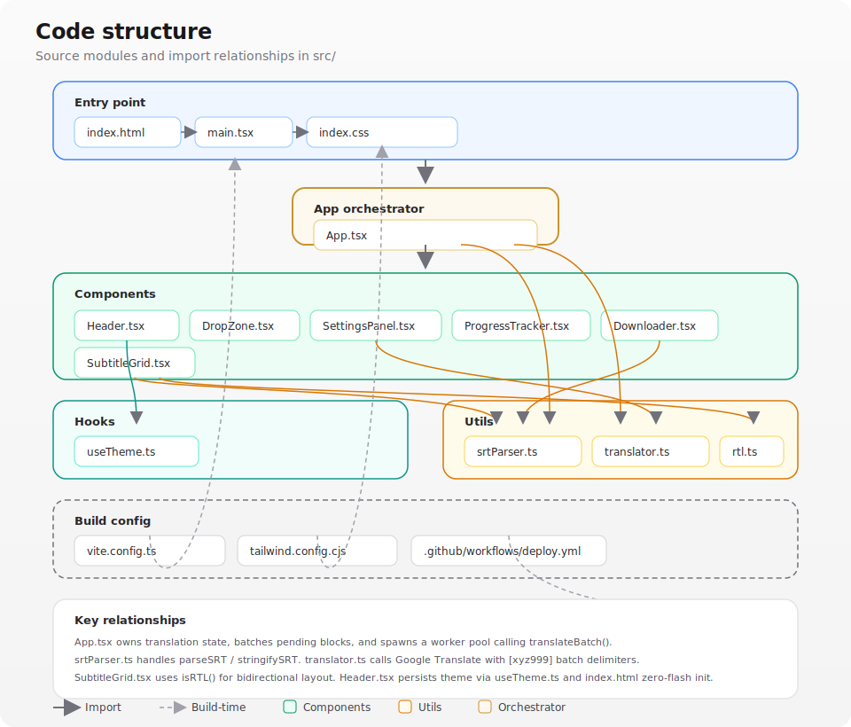

# Universal Subtitle Translator

An interactive, production-grade React web application that translates `.srt` subtitle files in-browser between **any language pair** — English to Spanish, Japanese to French, Arabic to Hebrew, and more.

## Live Demo & Web App

You can run this application entirely in your browser. Fully static, client-side, with zero server fees or upload telemetry!

👉 **[Access the Hosted App Live](https://yuvalkolodkingal.github.io/Universal-Subtitle-Translator/)**

📖 **[Project Wiki](https://github.com/yuvalkolodkingal/Universal-Subtitle-Translator/tree/main/docs/wiki)** — architecture, pipeline, development, and FAQ

### Web Features
- **Interactive File Sandbox** — Drag & drop subtitle `.srt` files and preview parses in real-time.
- **Engine Control Settings** — Adjust target and source languages, batch chunk bundle capacities, and rate limits.
- **Inline Workspace Editor** — Search parsed tracks and manually edit translated lines on-the-fly inside the browser before downloading.
- **Resumable Operations** — Pause, edit, or adjust speed profiles safely without wiping session state.

---

## Repository Mirror

This repository is mirrored on Codeberg:

🪞 **[Mirror on Codeberg](https://codeberg.org/YuvalKolodkin/Universal-Subtitle-Translator)**

---

## Architecture

### Tech stack

Client-side SPA: React and TypeScript bundled with Vite, styled with Tailwind and OKLCH tokens. Translation runs in the browser via batched calls to Google Translate; GitHub Actions builds and deploys to GitHub Pages.

<p align="center">
  
</p>

### Code structure

`App.tsx` orchestrates UI components, translation state, and the worker pool. Utilities handle SRT parsing, batch translation, and RTL text detection.

<p align="center">
  
</p>

---

## How It Works

Standard `.srt` files can have thousands of subtitle blocks. Translating them individually would be extremely slow and trigger rate limits almost immediately.

The React engine bundles multiple blocks into a single translation request using a `[xyz999]` delimiter, then splits the response back into individual blocks. This reduces API calls by ~98% — a 1,500-line subtitle file typically completes in under 90 seconds on free-tier translation services.

If the translation engine alters the delimiter and the response can't be cleanly split, the system automatically falls back to translating that batch block-by-block so nothing is lost.

## Setup & Local Development

To run this application locally on your computer:

```bash
# 1. Install dependencies
npm install

# 2. Run the development server
npm run dev
```

Open `http://localhost:5173` in your browser.

## License

MIT
